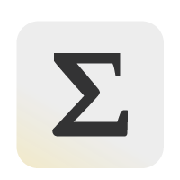

 

  

 <h1 align="center"><b>Epsilon</b></h1>
  

 Health & Fitness notes.
     
 
  

  An open source workout tracker that does not use your data against you
  

 

 

**Epsilon** es una app hecha en *ReactNative* para hacer seguimiento de los entrenamientos. Consiste en registrar tus datos y tu entrenamiento, y la app se encargará de mostrar la progresión en los ejercicios que hayas registrado. Se mostrará en diferentes gráficos y formas, segmentando por grupo muscular, volumen, e intensidad. 

También permite el cáculo de diferentes metricas: cálculo del RM, velocidad, etc.

 

> NOTA: Epsilon esta en desarrollo, muchas de las categorias mencionadas son experimentales y sujetas a cambios.

Características que vendrán pronto:

  - Strava API
  - Google Fit
  - Microsoft CodePush

